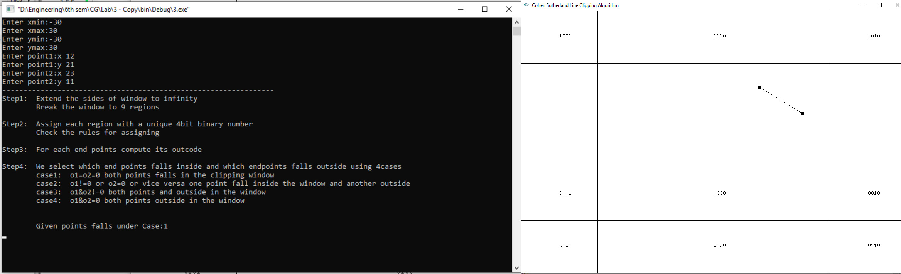

<b>Algorithm of Cohen Sutherland Line Clipping</b> 
<b>Input:</b> Two endpoints of a line, Clipping window size(xmin,xmax,ymin,ymax) 
<b>Output:</b> Displays what part of the line is clipped and what part of line is not clipped

<b>Step 1:</b> Extend the window to infinity 
&emsp;&emsp;&emsp; Break the window into 9 regions 

<b>Step 2:</b> Assign each region with unique 4bit binary number b0b1b2b3  
b0 = 1 if y>ymax 
&emsp;&emsp; 0 otherwise

b1 = 1 if y<ymin 
&emsp;&emsp; 0 otherwise

b2 = 1 if x>xmax 
&emsp;&emsp; 0 otherwise

b3 = 1 if x<xmin 
&emsp;&emsp; 0 otherwise  

<b>Step 3:</b> For each end points compute its outcodes(rule same as above binary number) 

<b>Step 4:</b> Consider a line segment whose outcodes are given by o1 = outcode(x1, y1) and o2 = outcode(x2, y2).
We can now reason on the basis of these outcodes. There are four cases:

<b>Case 1:</b>(o1 = o2 = 0). Both endpoints are inside the clipping window. 
<b>Case 2:</b>(o1 = 0, o2 = 0; or vice versa). One endpoint is inside the clipping window;one is outside. 
<b>Case 3:</b>(o1 & o2 = 0)Both endpoints are outside but part of line segment falls inside the window.  
<b>Case 4:</b>(o1 & o2 = 0)Both endpoints are outside and no part of line segment falls inside the window.  
<b>Case 1:</b> 
<b>Case 2:</b> 
<b>Case 3:</b> 
<b>Case 4:</b> 
